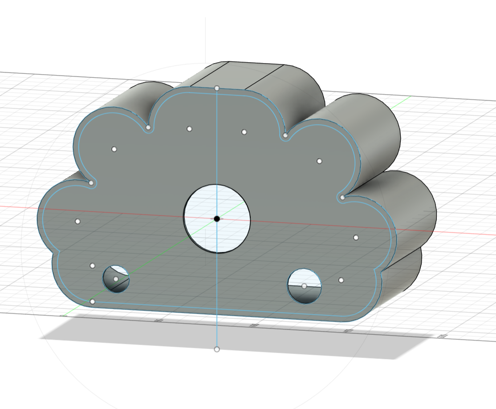

# GEM-the-sentiment-Robot
This robot embodies an AI system by integrating the Gemini API with an ESP32 allowing someone to talk to it and get a response back. The robot's facial expressions are connected to a sentiment analysis model to interpret different emotions. I'm using this project to explore how natural language processing can help robots better understand human emotion and communication.

# Electronic Aspect
For the electrical components I'm using a 
- TFT Display
- ESP32-S3 Development Board
- INMP441 I2S Digital Microphone
- MAX98357A I2S Audio Amplifier
- 8 Ohm 1W Small Speaker
- 18650 battery

I couldn't really find a simulation software that had all the parts to show the connection, but I've explained it in the table below:
| Component               | Pin  | ESP32-S3 Pin | Purpose                              |
| ----------------------- | ---- | ------------ | ------------------------------------ |
| **Common**              | GND  | GND          | Shared ground for all components     |
|                         | 3.3V | 3.3V         | Power for TFT display and microphone |
|                         | 5V   | 5V           | Power for amplifier                  |
| **TFT Display (SPI)**   | VCC  | 3.3V         | Screen power                         |
|                         | GND  | GND          | Ground                               |
|                         | SCK  | GPIO36       | SPI clock                            |
|                         | MOSI | GPIO35       | SPI data from ESP32                  |
|                         | CS   | GPIO34       | Chip select                          |
|                         | DC   | GPIO33       | Data / command control               |
|                         | RST  | GPIO37       | Reset pin                            |
|                         | BL   | 3.3V         | Backlight power                      |
| **INMP441 Microphone**  | SD   | GPIO14       | I2S data input                       |
|                         | WS   | GPIO16       | I2S word select                      |
|                         | SCK  | GPIO15       | I2S bit clock                        |
|                         | L/R  | GND          | Sets microphone to left channel      |
| **MAX98357A Amplifier** | DIN  | GPIO17       | I2S audio data output                |
|                         | LRC  | GPIO16       | Shared with microphone WS            |
|                         | BCLK | GPIO15       | Shared with microphone SCK           |
|                         | VIN  | 5V           | Amplifier power                      |
|                         | GND  | GND          | Ground                               |

# The Body of GEM
For the body, I used fusion 360 to give it a cloud shaped body. The holes on the model are for the face(TFT Display screen), microphone, and speaker.

This is the link to getting the full .f3d file for the body:
[Download the Fusion 360 body file](GEM_Model_f3d.f3d)

# Initial Arduino code
[This code](GEM_initial_code.ino) is an initial code for the the different parts.
In this code some of the things have not been filled for privacy reasons such as 
- my wifi id
- my wifi password
- my gemini api key and url.

The Emotion_API is simply the address the ESP32 uses to reach my Python emotion server running on my PC.
I'm currently still working on the emotion model, but it would be something similar to my [book review model](https://github.com/Chiamanda07/ML_bookReview_Project) I made some time ago, but with much more labels (emotions).

# BOM
